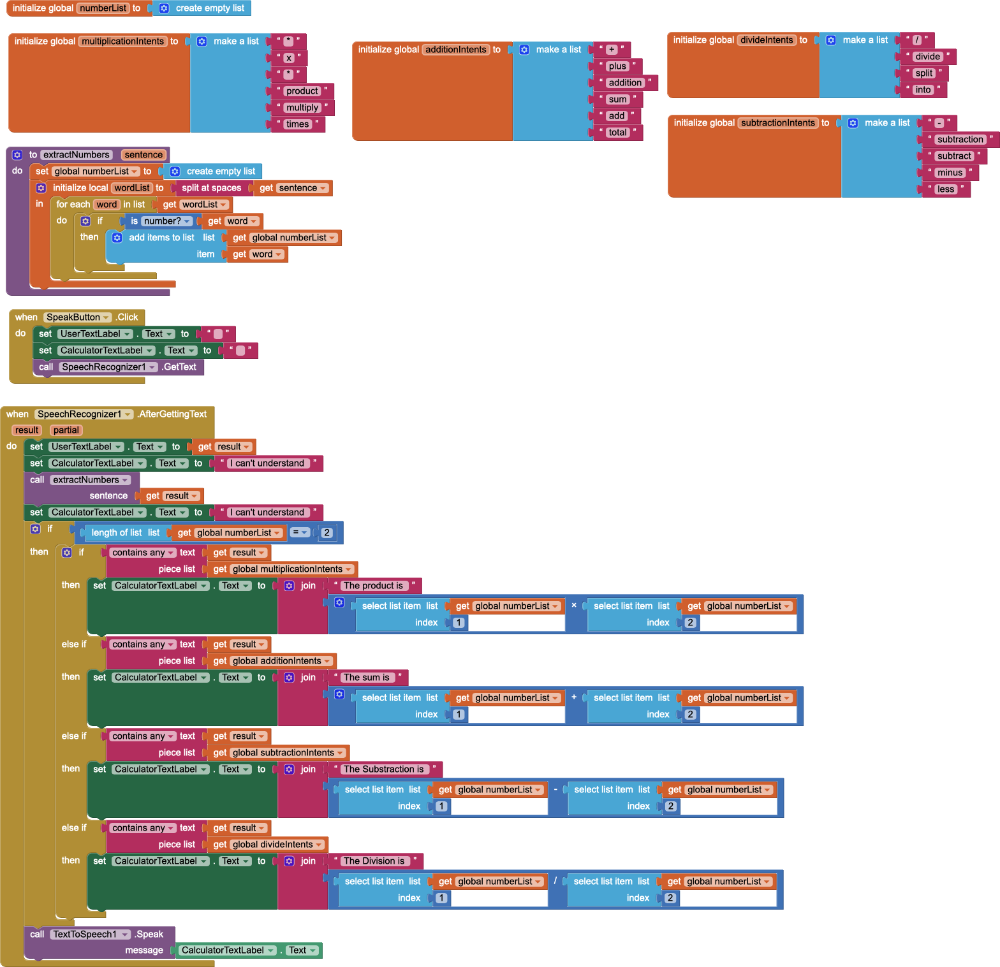

## Introduction - APP Inventor by MIT

> The purpose of this AI project is to give you a sense of the basics of a Voice User Interface (VUI) and to teach you how to design a simple AI system that can understand the intent of the user in a verbally stated calculation question and respond appropriately. Such a voice-driven AI system can be useful in various contexts such as when designing assistive technologies for the visually disabled and the elderly. For example, a visually impaired user can use the Voice Calculator to do mathematical calculations verbally without having to type in all the details of the calculation. "APP INVENTOR MIT"

## Functionality

The app receive a voice input from the user, processes the speech to text, identifies numbers and arithmetic operation words, and then performs the requested calculation.

## Logic Flow

1. Initialization: Lists of numbers and number operations are created.
2. Speech Recognition: When the user hits speak, it sets off a speech recognizer.
3. Text Parsing: Firstly, after the text is transformed from speech there is parsing and it includes extraction of numbers along with identification an operation by using a fixed list that has words.
4. Calculation: Based from the mentioned words, the app determines which arithmetic operation to use.
5. Result Output: The results are computed by the app and presented on screen with text-to speech synthesis.

The app provides the users with quick and accurate arithmetic calculation results without even needing to touch anything, which shows that voice-controlled computation can actually make a change.

## Notes

- The app is designed for clear and slow-spoken commands to optimize recognition accuracy.
- It includes error handling for situations where speech is unclear or operations are ambiguous.
- for testing is recommended donwload the APK file and install in the emulator of andoid studio,because with other methods could have issues.

For a detailed view of the blocks and logic, see the attached image.

## Acknowledgments

This app was developed using [MIT App Inventor](https://appinventor.mit.edu/), The voice-activated calculator concept is inspired by resources available on the MIT App Inventor website.

-Tutorial [MIT App Inventor Voice Calculator Resource](https://appinventor.mit.edu/explore/resources/ai/voice-calculator).

